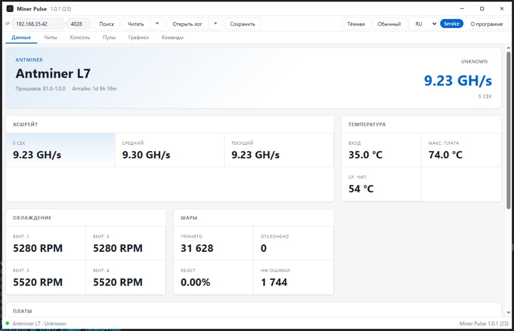
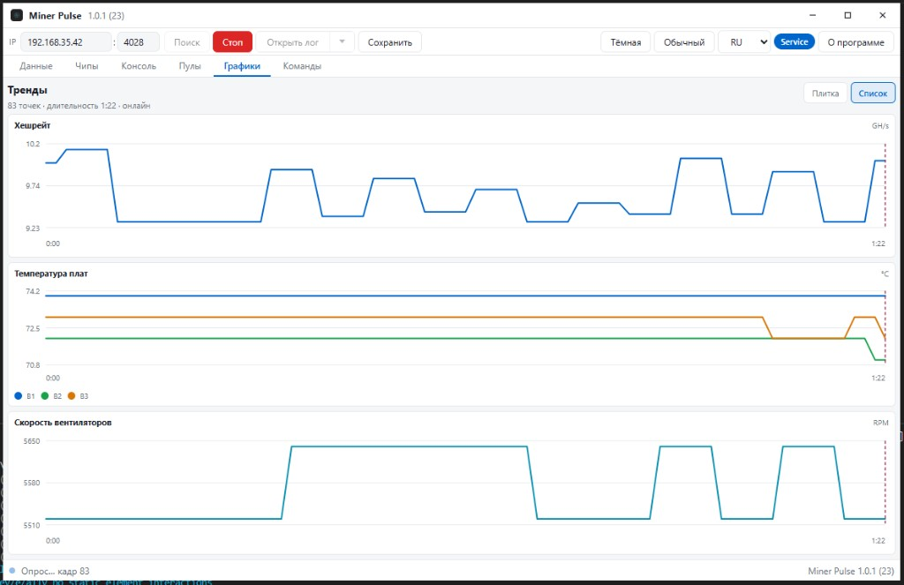
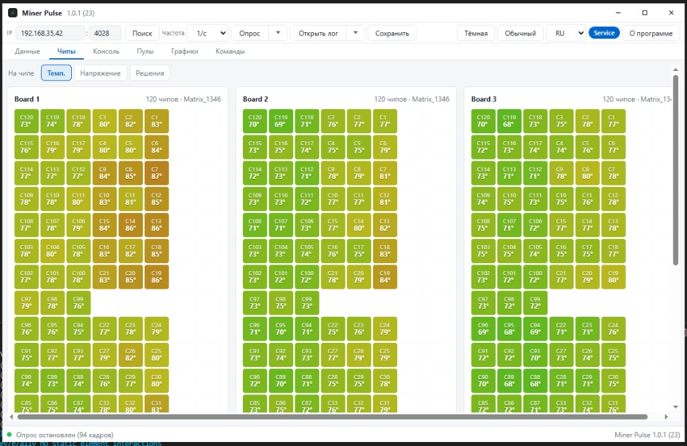
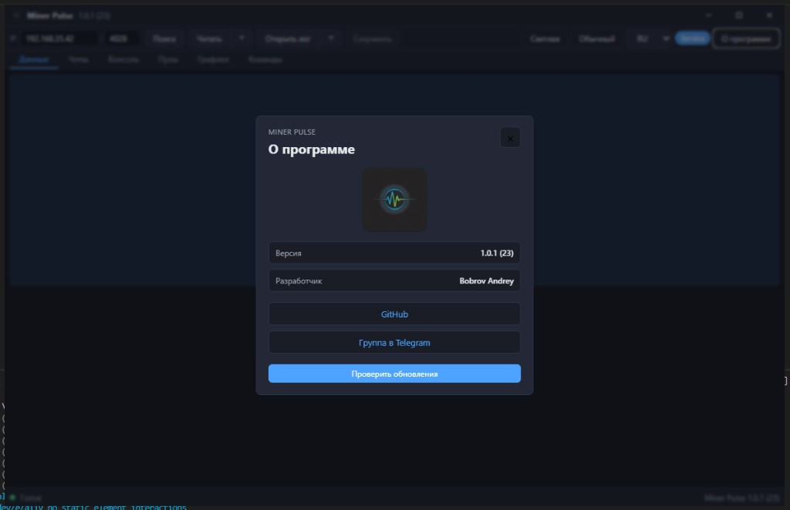

<p align="center">
  <a href="README.md"><strong>🇷🇺 Русский</strong></a>
  &nbsp;·&nbsp;
  <a href="README.en.md"><strong>🇺🇸 English</strong></a>
</p>

<p align="center">
  
</p>

<h1 align="center">Miner Pulse</h1>

<p align="center">
  <strong>Desktop monitoring for ASIC miners</strong><br />
  WhatsMiner · Antminer · Avalon — polling, logs, charts, chip map
</p>

<p align="center">
  <a href="https://mpulse.bob4.fun">Website</a>
  ·
  <a href="https://github.com/BobJustFry/MinerPulse/releases/latest">Download for Windows</a>
  ·
  <a href="docs/user-guide/en.md">User guide</a>
  ·
  <a href="https://t.me/miner_pulse">Telegram</a>
  ·
  <a href="#support-the-project">Donate</a>
</p>

<p align="center">
  
  
  
  
  
</p>

---

> **License:** proprietary software. **Forking, copying and plagiarism are prohibited** without the copyright holder's written permission.  
> Details: **[LICENSING.md](LICENSING.md)** · [LICENSE](LICENSE)

---

## About

**Miner Pulse** is a desktop application for engineers and operators of mining farms. It connects to a miner by IP, reads telemetry in real time, draws charts, shows the chip map and helps analyze logs.

The interface is available in **Russian**, **English** and **Chinese**, with light and dark themes.

## Screenshots

### Data panel

Hashrate, temperatures, fans, shares and boards — all on one screen.

<p align="center">
  
</p>

### Charts

Polling with a configurable rate. "Tiles" and "List" modes — convenient on a wide monitor.

<p align="center">
  
</p>

### Chip map

Temperature, voltage and statistics for every chip on a board (WhatsMiner / Antminer).

<p align="center">
  
</p>

### About

Update check, links to GitHub and Telegram, version info.

<p align="center">
  
</p>

## Features

| Section | What it does |
|---------|--------------|
| **Data** | Model, firmware, uptime, hashrate, temperatures, RPM, shares, HW errors, boards, **pools** |
| **Chips** | Chip matrix: temperature, voltage, solutions |
| **Console** | Raw log / API response |
| **Charts** | Hashrate, board temperatures, power, fans; `.mprs` recording and playback |
| **Commands** | Send commands to Avalon miners (Client/Service) |
| **Search** | Subnet scan, favorite IP ranges |
| **Import** | `.mprs` / `.mpsn` / `.mpulse`, `.txt` logs, drag & drop for text logs |
| **Updates** | Signed auto-updater from GitHub Releases |

### Supported families

- **WhatsMiner** — API v2/v3, chip map, error codes
- **Antminer** — cgminer API (L7, E9, etc.)
- **Avalon** — TCP commands

## Installation

1. Open [Releases](https://github.com/BobJustFry/MinerPulse/releases/latest).
2. Download **`MinerPulse_*_x64-setup.exe`**.
3. Install (NSIS, administrator rights — see [SECURITY.md](SECURITY.md)).
4. Launch, enter the miner's IP and port (usually `4028`), click **Read** or **Poll**.

> The version and build number are shown in the window title: `Miner Pulse X.Y.Z (BBB)`.

## For developers

**Windows:**

```powershell
cd minerpulse-desktop
npm install
npm run dev:app
```

| Field | File | Rule |
|-------|------|------|
| Version `X.Y.Z` | `VERSION.json` | Changed **only with the owner's approval** |
| Build `BBB` | `VERSION.json` | `node scripts/bump-build.mjs` after every change |

More: **[docs/user-guide/en.md](docs/user-guide/en.md)** · [docs/DEVELOPMENT.md](docs/DEVELOPMENT.md) · [REPOSITORY.md](REPOSITORY.md) · [LICENSING.md](LICENSING.md) · [LICENSE](LICENSE)

## License and usage

Miner Pulse is a **proprietary product** (© Bobrov Andrey / BobJustFry). All rights reserved.

| Allowed | Prohibited without written consent |
|---------|-------------------------------------|
| Official [Releases](https://github.com/BobJustFry/MinerPulse/releases) | Forks and mirrors of the repository |
| Viewing the code, Issues | Copying code, UI, logos |
| | Plagiarism and passing it off as your own product |
| | Building and distributing from source |

GitHub's "Fork" button **is not permission** — see [LICENSING.md](LICENSING.md).

## Repository structure

```
minerpulse-core/       Rust: drivers, TCP, snapshots, import
minerpulse-desktop/    Tauri + Svelte UI
platform/              Subscriptions: API, web, admin, deploy (Docker)
docs/user-guide/       User guide (RU / EN / 中文)
docs/screenshots/      README screenshots
releases/              update.json — auto-update manifest
scripts/               bump build / sync version
```

More about deploying the subscription platform: **[platform/README.md](platform/README.md)**.

## Contacts

- **GitHub:** [BobJustFry/MinerPulse](https://github.com/BobJustFry/MinerPulse)
- **Website:** [mpulse.bob4.fun](https://mpulse.bob4.fun)
- **Telegram:** [@miner_pulse](https://t.me/miner_pulse)
- **Developer:** Bobrov Andrey

## Support the project

Development is done in spare time. If Miner Pulse helps you in your work, you can say thanks:

```
USDT Solana: EzWsXMzciLAWb34Jnz1SbtazhAAQKuAhnYa2b5dEzHBk
```

The same address is shown in the app: **About → Support the project**.

---

<p align="center"><sub>Miner Pulse · © Bobrov Andrey · proprietary · <a href="LICENSING.md">LICENSING</a> · <a href="LICENSE">LICENSE</a></sub></p>
