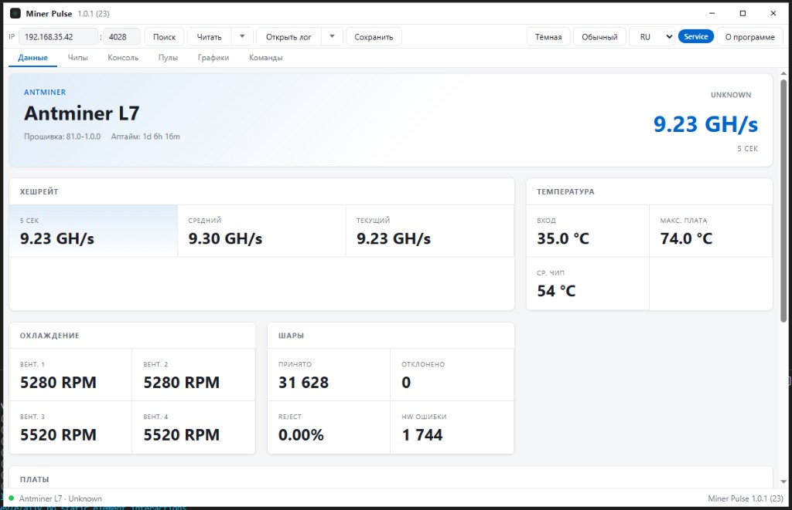
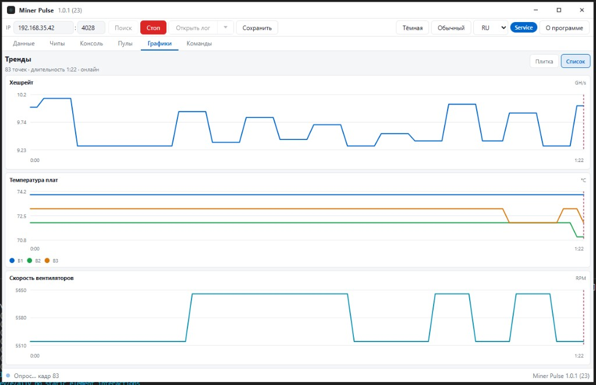
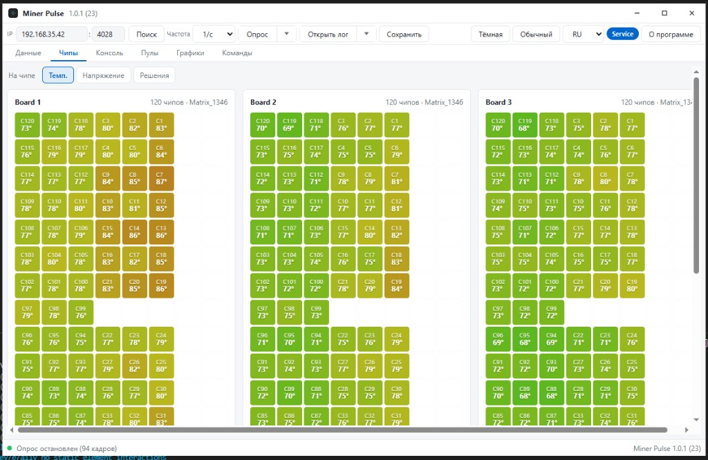
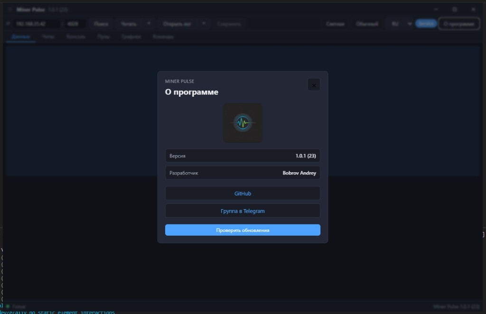

<p align="center">
  
</p>

<h1 align="center">Miner Pulse</h1>

<p align="center">
  <strong>Мониторинг ASIC-майнеров на рабочем столе</strong><br />
  WhatsMiner · Antminer · Avalon — опрос, логи, графики, карта чипов
</p>

<p align="center">
  <a href="https://github.com/BobJustFry/MinerPulse/releases/latest">Скачать для Windows</a>
  ·
  <a href="https://t.me/miner_pulse">Telegram</a>
  ·
  <a href="#поддержать-проект">Донат</a>
</p>

<p align="center">
  
  
  
  
  
</p>

---

> **Лицензия:** проприетарное ПО. **Форк, копирование и плагиат запрещены** без письменного разрешения правообладателя.  
> Подробно: **[LICENSING.md](LICENSING.md)** · [LICENSE](LICENSE)

---

## О программе

**Miner Pulse** — настольное приложение для инженеров и операторов майнинг-ферм. Подключается к майнеру по IP, читает телеметрию в реальном времени, строит графики, показывает карту чипов и помогает разбирать логи.

Интерфейс на **русском**, **английском** и **китайском**. Светлая и тёмная темы.

## Скриншоты

### Панель данных

Хешрейт, температуры, вентиляторы, шары и платы — всё на одном экране.

<p align="center">
  
</p>

### Графики

Опрос с настраиваемой частотой. Режимы «Плитка» и «Список» — удобно на широком мониторе.

<p align="center">
  
</p>

### Карта чипов

Температура, напряжение и статистика по каждому чипу на плате (WhatsMiner / Antminer).

<p align="center">
  
</p>

### О программе

Проверка обновлений, ссылки на GitHub и Telegram, информация о версии.

<p align="center">
  
</p>

## Возможности

| Раздел | Что умеет |
|--------|-----------|
| **Данные** | Модель, прошивка, аптайм, хешрейт (5s / avg / RT), температуры, RPM, шары, HW-ошибки, платы |
| **Чипы** | Матрица чипов: температура, напряжение, решения |
| **Консоль** | Сырой лог / ответ API |
| **Пулы** | Активные и резервные пулы, статус |
| **Графики** | Хешрейт, температуры плат, скорость вентиляторов; запись и воспроизведение сессий |
| **Команды** | Отправка команд майнеру (Service) |
| **Поиск** | Сканирование подсети, выбор майнера из списка |
| **Импорт** | Открытие `.mpulse` логов и сессий, drag & drop |
| **Обновления** | Подписанный авто-апдейтер из GitHub Releases |

### Поддерживаемые семейства

- **WhatsMiner** — API v2/v3, карта чипов, коды ошибок
- **Antminer** — cgminer API (L7, E9 и др.)
- **Avalon** — TCP-команды

## Установка

1. Откройте [Releases](https://github.com/BobJustFry/MinerPulse/releases/latest).
2. Скачайте **`MinerPulse_*_x64-setup.exe`**.
3. Установите (NSIS, права администратора — см. [SECURITY.md](SECURITY.md)).
4. Запустите, введите IP и порт майнера (обычно `4028`), нажмите **Читать** или **Опрос**.

> Версия и номер сборки отображаются в заголовке окна: `Miner Pulse X.Y.Z (BBB)`.

## Для разработчиков

**Windows:**

```powershell
cd minerpulse-desktop
npm install
npm run dev:app
```

| Поле | Файл | Правило |
|------|------|---------|
| Версия `X.Y.Z` | `VERSION.json` | Меняется **только с одобрения владельца** |
| Сборка `BBB` | `VERSION.json` | `node scripts/bump-build.mjs` после каждого изменения |

Подробнее: [docs/DEVELOPMENT.md](docs/DEVELOPMENT.md) · [REPOSITORY.md](REPOSITORY.md) · [LICENSING.md](LICENSING.md) · [LICENSE](LICENSE)

## Лицензия и использование

Miner Pulse — **проприетарный продукт** (© Bobrov Andrey / BobJustFry). Все права защищены.

| Разрешено | Запрещено без письменного согласия |
|-----------|-------------------------------------|
| Официальные [Releases](https://github.com/BobJustFry/MinerPulse/releases) | Форк и зеркала репозитория |
| Просмотр кода, Issues | Копирование кода, UI, логотипов |
| | Плагиат и выдача за свой продукт |
| | Сборка и распространение из исходников |

Кнопка «Fork» на GitHub **не является разрешением** — см. [LICENSING.md](LICENSING.md).

## Структура репозитория

```
minerpulse-core/       Rust: драйверы, TCP, снимки, импорт
minerpulse-desktop/    Tauri + Svelte UI
platform/              Подписки: API, web, admin, deploy (Docker)
docs/screenshots/      Скриншоты для README
releases/              update.json — манифест авто-обновления
scripts/               bump build / sync version
```

Подробнее о деплое платформы подписок: **[platform/README.md](platform/README.md)**.

## Контакты

- **GitHub:** [BobJustFry/MinerPulse](https://github.com/BobJustFry/MinerPulse)
- **Telegram:** [@miner_pulse](https://t.me/miner_pulse)
- **Разработчик:** Bobrov Andrey

## Поддержать проект

Разработка ведётся в свободное время. Если Miner Pulse помогает вам в работе — можно поблагодарить:

```
USDT TRC20: TAQLsXQA7WzNfoCTHvXxj8yFBXTJRKz99w
```

Тот же адрес указан в приложении: **О программе → Поддержать проект**.

---

<p align="center"><sub>Miner Pulse · © Bobrov Andrey · proprietary · <a href="LICENSING.md">LICENSING</a> · <a href="LICENSE">LICENSE</a></sub></p>
